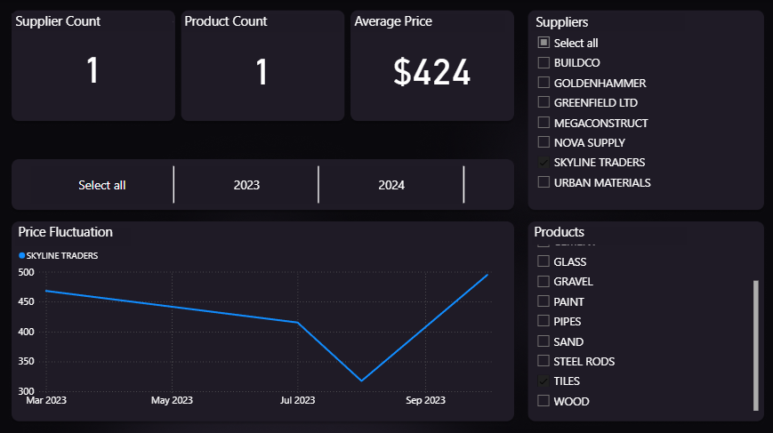
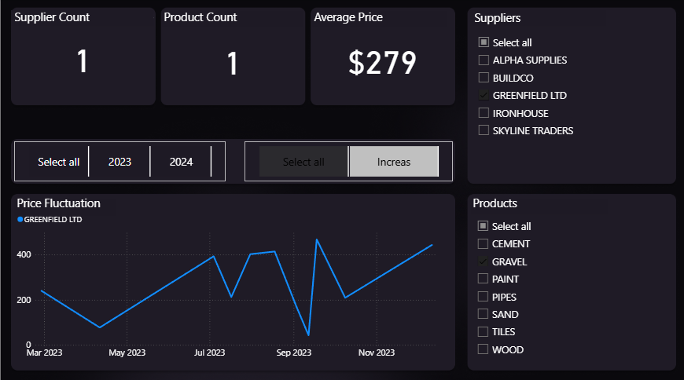

# Procurement Analysis

### Overview
During my volunteer experience, the company sought to optimize its procurement spending. I analyzed their procurement data (Supplier, Product, Price, and Date) to identify the cheapest suppliers, compared the average and the minimum prices of the products, and calculated how much the company can save both in percentage and currency if the products are bought from the cheapest suppliers only. Visualized price fluctuations and separated the products that had either risen or decreased for easier research and understanding.

**Tools Used:** Python (pandas, numpy), Power BI

---

## Problem Statement
- Identify the cheapest suppliers. Make a list of suppliers, products, prices, and the date we bought them.
- Calculate the savings. Compare the minimum and average prices.
- Separate the products that have either risen or decreased. Visualize them for clarity and easier research.

## Workflow
1. **Data Cleaning (using Python)**
   - Removed duplicates and empty rows using Python (pandas). There were only a few empty rows, that's why by deleting them I wouldn't loose any valuable information.
   - Removed empty spaces, non-breaking spaces, and 0-width spaces. Removed commas, stripped, and made everything uppercased for consistency. This part was important because the data was imported from an external source and was quite messy.  
3. **Visualization in Power BI**  
   - Built interactive dashboards for price fluctuations. Added filters for date, supplier, and product to view each product's price separately.
   - Used DAX to create measures such as the distinct count of suppliers and products, average price for each product.

---

## Project Files  
- [Power BI Dashboard](Power_BI/Power_BI_Report.pbix)
- [Python Code](Python/Python_Code.ipynb)
- [Cleaned Data and Excel file](Results)
- [Raw Data](sample_dataset.xlsx)

---

